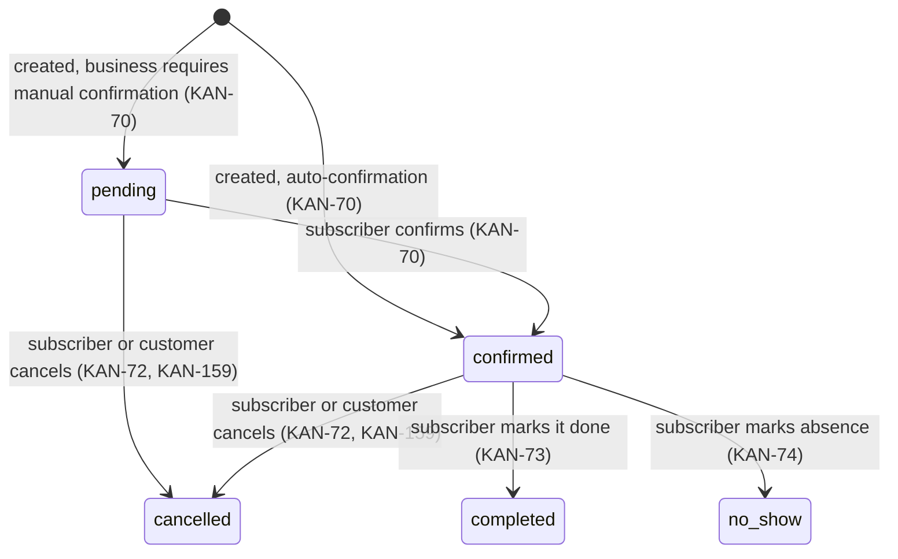
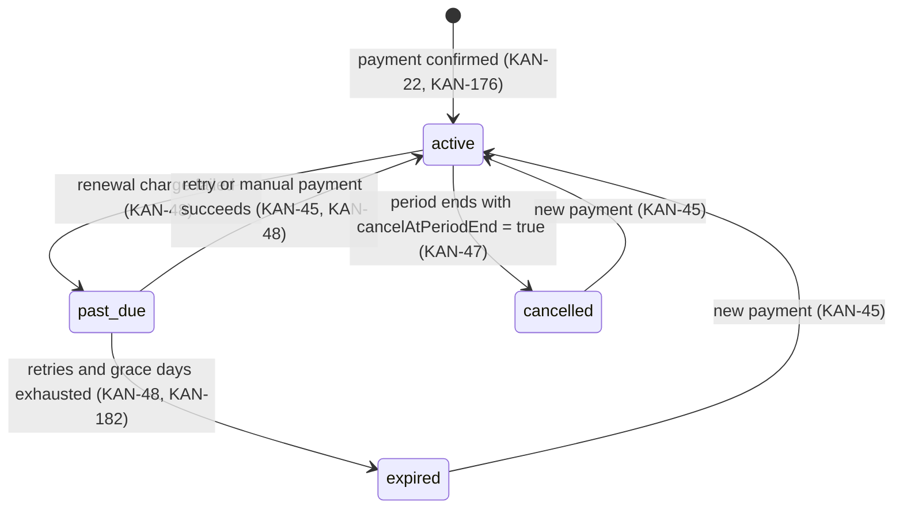
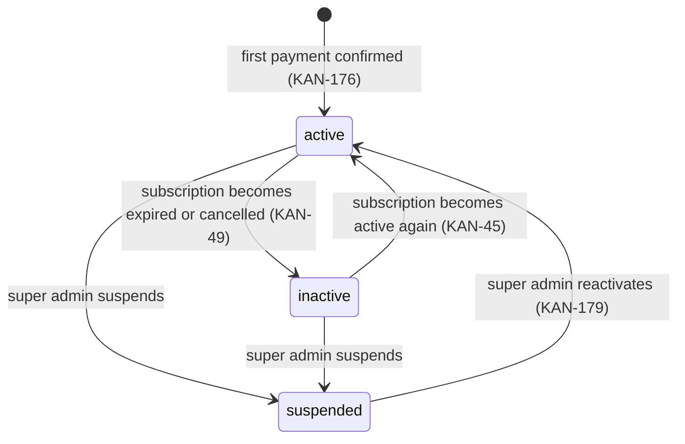
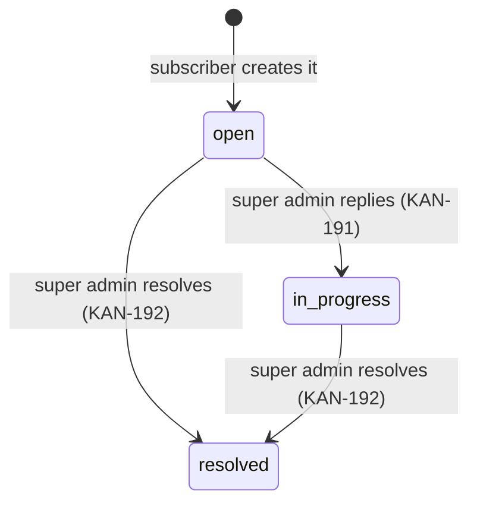

# Domain Glossary

This skill is the **single source of truth** for:

1. The English identifier of every business concept that appears in the backlog (Jira project KAN, written in Spanish).
2. Firestore collection names and the tenant key.
3. The status values of each entity and the **only** transitions allowed between them.

## Precedence

| Topic | Owner |
| --- | --- |
| Domain names, status values, transitions | **this skill** (wins over every other skill) |
| Who may trigger a transition, Firestore rules, tenant isolation | `auth-and-roles` |
| Visible labels for statuses and entities (`"Confirmada"`, `"No show"`) | `i18n-standards` — labels never live in these constants |
| File naming, `as const`, alphabetical keys, barrel exports | `constants-standards` |
| Reading/writing the entities | `api-query-standards` / `api-mutation-standards` |

If another skill's example uses a name that contradicts this glossary, the glossary wins and the other skill must be fixed.

---

## 1. Actors and roles

| Backlog (ES) | Code (EN) | Auth role (`custom claim role`) | Portal |
| --- | --- | --- | --- |
| Super administrador | super admin | `super_admin` | `admin` |
| Suscriptor (dueño del negocio) | subscriber | `subscriber` | `business` |
| Cliente (con cuenta) | customer | `customer` | `customer` |
| Visitante (sin cuenta) | visitor | — (unauthenticated, not a role) | `landing`, `customer` (read-only) |
| Colaborador | collaborator | **BLOCKED — Q1** | — |

## 2. Portals

| Backlog (ES) | Code (EN) | Folder |
| --- | --- | --- |
| Landing | landing | `src/portals/landing/` |
| Negocio | business | `src/portals/business/` |
| Cliente | customer | `src/portals/customer/` |
| Admin | admin | `src/portals/admin/` |

## 3. Entities

| Backlog (ES) | Code (EN) | Firestore path | Notes |
| --- | --- | --- | --- |
| Negocio | `Business` | `businesses/{businessId}` | The tenant. Owned by one subscriber (`ownerUserId`). |
| Usuario / cuenta | `User` | `users/{userId}` | Platform-wide account (subscriber, customer or super admin). |
| Cliente del negocio | `Customer` | `businesses/{businessId}/customers/{customerId}` | Business-scoped record. `userId` is `Nullable` because a subscriber can add customers without an account (KAN-88). Blocking (KAN-93) and anonymizing (KAN-98) apply here only, never to `User`. |
| Servicio | `Service` | `businesses/{businessId}/services/{serviceId}` | |
| Descuento / promoción | `ServiceDiscount` | field `discounts` on `Service` | KAN-60 |
| Reserva / reservación / cita | `Booking` | `businesses/{businessId}/bookings/{bookingId}` | Stores `serviceSnapshot` (name, price, duration at booking time, KAN-62). `customerUserId` is the customer's account, `Nullable` for bookings created by the subscriber for customers without an account (KAN-69). |
| Horario de atención | `BusinessHours` | field on `Business` | KAN-64 |
| Bloqueo de agenda / día bloqueado | `ScheduleBlock` | `businesses/{businessId}/scheduleBlocks/{scheduleBlockId}` | Partial (KAN-65) or full-day (KAN-66). |
| Agenda | `Schedule` | — (view, not stored) | Bookings + schedule blocks in a calendar. |
| Horario disponible | `TimeSlot` | — (computed) | KAN-141 |
| Políticas de reservación | `BookingPolicy` | field on `Business` | Cancellation/reschedule window and penalty (KAN-147, KAN-160). |
| Plan | `Plan` | `plans/{planId}` | Includes `limits` (KAN-181). |
| Suscripción | `Subscription` | `businesses/{businessId}/subscription/current` | One active subscription per business. |
| Pago / cobro | `Payment` | `businesses/{businessId}/payments/{paymentId}` | Simulated gateway. |
| Comprobante | `PaymentReceipt` | — (generated file) | KAN-45 |
| Ticket / consulta de soporte | `SupportTicket` | `supportTickets/{supportTicketId}` | Created by subscribers, answered by super admin. |
| Auditoría / log | `AuditLogEntry` | `auditLog/{auditLogEntryId}` | Action types: **BLOCKED — Q3** |
| Parámetros globales | `PlatformSettings` | `platformSettings/current` | Idle timeout, grace days, limits (KAN-182). |
| Notificación / alerta interna | `Notification` | `users/{userId}/notifications/{notificationId}` | KAN-101 |
| Recordatorio | `Reminder` | — (scheduled Cloud Function) | KAN-100, KAN-165 |
| Reporte | `Report` | — (computed) | KAN-102 |

### Naming rules

- The tenant key is always `businessId`. Never `tenantId`, `companyId`, `shopId` or `storeId`.
- Use `Booking` everywhere. Never `Appointment`, `Reservation` or `Cita` in identifiers.
- Use `Customer` for the person who books. Never `Client` (it clashes with `queryClient` and HTTP clients).
- Prices are integers in minor units: `priceInCents`. Durations are integers with their unit: `durationMinutes`.
- Dates are `Date` objects in domain models (`startsAt`, `endsAt`, `createdAt`). Converting from Firestore `Timestamp` belongs to the adapter in `api-query-standards`.
- Every business stores its IANA `timeZone`. Never compute slots in the browser's time zone.

---

## 4. Status machines

Each machine lives in `src/shared/domain/<entity>/` as:

- `<Entity>Status.constants.ts` — the status object, its derived type and its transition map.
- Everything is re-exported from `src/shared/domain/index.ts` and imported as `@/shared/domain`.

Terminal statuses have an empty transition list. A transition that is not in the map is forbidden in the UI **and** in `firestore.rules`.

### 4.1 Booking



- **Rescheduling is not a status.** It changes `startsAt`/`endsAt` on a `pending` or `confirmed` future booking and appends to `rescheduleHistory` (KAN-71, KAN-158).
- A cancellation stores `cancellation: { cancelledBy, isPenalized, note }` (KAN-72, KAN-161).
- `completed` and `no_show` are only allowed once `startsAt` has passed.

### 4.2 Subscription



- Cancelling (KAN-47) does **not** change the status immediately. It sets `cancelAtPeriodEnd: true`, and access stays full until `currentPeriodEndsAt`.
- `expired` and `cancelled` make the business read-only (KAN-49). Enforcement belongs to `auth-and-roles`.
- The number of retries and what the simulated gateway does on renewal: **BLOCKED — Q5**.

### 4.3 Business



- `inactive` is automatic (it follows the subscription). `suspended` is a manual super admin action.
- `pending` (KAN-175 filter): **BLOCKED — Q2**. Do not add it until the decision is recorded.

### 4.4 Support ticket



"Cerrar" and "marcar como resuelto" (KAN-192) are the same transition. There is no reopen in the backlog.

### 4.5 Simple two-state entities

| Entity | Statuses | Stories |
| --- | --- | --- |
| `Service` | `active` ↔ `inactive`; delete only when `inactive` and without `pending`/`confirmed` bookings | KAN-57, KAN-58, KAN-59 |
| `Customer` | `active` ↔ `blocked`; both directions require a `note` | KAN-93, KAN-94 |
| `Plan` | `active` ↔ `inactive`; inactive plans are hidden from the catalog but keep their subscribers | KAN-184 |

### Incorrect

```ts
// Ad-hoc literals, a synonym for Booking, and an unchecked transition
const cancelAppointment = (appointment: { status: string }): void => {
  if (appointment.status === "confirmed" || appointment.status === "pending") {
    appointment.status = "canceled";
  }
};
```

Problems: `appointment` is a forbidden synonym, `"canceled"` does not exist (the value is `"cancelled"`), the allowed transitions are duplicated by hand, and the status type is a plain `string`.

### Correct

```ts
// src/shared/domain/stateMachine.ts
export type TransitionMap<Status extends string> = Readonly<
  Record<Status, readonly Status[]>
>;

export const canTransition = <Status extends string>(
  transitionMap: TransitionMap<Status>,
  currentStatus: Status,
  nextStatus: Status,
): boolean => transitionMap[currentStatus].includes(nextStatus);
```

```ts
// src/shared/domain/booking/BookingStatus.constants.ts
import type { TransitionMap } from "../stateMachine";

export const BOOKING_STATUS = {
  CANCELLED: "cancelled",
  COMPLETED: "completed",
  CONFIRMED: "confirmed",
  NO_SHOW: "no_show",
  PENDING: "pending",
} as const;

export type BookingStatus =
  (typeof BOOKING_STATUS)[keyof typeof BOOKING_STATUS];

export const CANCELLATION_ACTOR = {
  BUSINESS: "business",
  CUSTOMER: "customer",
} as const;

export type CancellationActor =
  (typeof CANCELLATION_ACTOR)[keyof typeof CANCELLATION_ACTOR];

export const BOOKING_STATUS_TRANSITIONS: TransitionMap<BookingStatus> = {
  [BOOKING_STATUS.CANCELLED]: [],
  [BOOKING_STATUS.COMPLETED]: [],
  [BOOKING_STATUS.CONFIRMED]: [
    BOOKING_STATUS.CANCELLED,
    BOOKING_STATUS.COMPLETED,
    BOOKING_STATUS.NO_SHOW,
  ],
  [BOOKING_STATUS.NO_SHOW]: [],
  [BOOKING_STATUS.PENDING]: [
    BOOKING_STATUS.CANCELLED,
    BOOKING_STATUS.CONFIRMED,
  ],
};
```

```ts
// src/shared/domain/booking/Booking.interface.ts
import type { Nullable } from "@/shared/types";
import type {
  BookingStatus,
  CancellationActor,
} from "./BookingStatus.constants";

export interface ServiceSnapshot {
  durationMinutes: number;
  name: string;
  priceInCents: number;
}

export interface BookingCancellation {
  cancelledBy: CancellationActor;
  isPenalized: boolean;
  note: Nullable<string>;
}

export interface Booking {
  businessId: string;
  cancellation: Nullable<BookingCancellation>;
  customerId: string;
  customerUserId: Nullable<string>;
  endsAt: Date;
  id: string;
  serviceId: string;
  serviceSnapshot: ServiceSnapshot;
  startsAt: Date;
  status: BookingStatus;
}
```

```ts
// Consumer (for example, inside a ViewModel)
import {
  BOOKING_STATUS,
  BOOKING_STATUS_TRANSITIONS,
  canTransition,
  type Booking,
} from "@/shared/domain";

export const isBookingCancellable = (booking: Booking): boolean =>
  canTransition(
    BOOKING_STATUS_TRANSITIONS,
    booking.status,
    BOOKING_STATUS.CANCELLED,
  );
```

The `TransitionMap<BookingStatus>` annotation makes `tsc` fail if a status is missing from the map or an unknown status appears in it.

---

## 5. Open decisions (BLOCKED)

Source: `docs/decisions/open-questions.md`. While a question is open, **do not** invent names, statuses or fields for it. Specs that depend on it are marked `BLOCKED` by `backlog-to-spec`.

| Id | Question | What stays blocked here |
| --- | --- | --- |
| Q1 | Is the collaborator a fifth actor? (KAN-78, 79, 84, 85, 86) | `Collaborator` entity, `collaboratorId` on `Booking`. Collaborators also appear in KAN-61, 67, 68, 81–83, 134–138 and 142. |
| Q2 | Does a `pending` business status exist? (KAN-175) | Business status `pending` |
| Q3 | Which "approvals" does KAN-194 audit? | `AuditLogEntry.actionType` values |
| Q4 | How is a business page reached: slug, subdomain or search? | `Business.slug` field and customer portal route segment |
| Q5 | What does the simulated gateway do on automatic renewals? (KAN-48) | Retry count and interval for `past_due` |
| Q6 | Can a visitor book without an account? (KAN-116) | Guest booking fields on `Booking` |
| Q7 | Does the MVP include checkout, or start with a business created by hand? | Initial transition into `Subscription.active` and `Business.active` |

When a decision is recorded, update this section and the affected machine **in the same PR**.

---

## 6. Enforced by

| Rule | Mechanism |
| --- | --- |
| No `appointment`, `reservation` or `tenant` in declared names | ESLint `id-match` (see `eslint.config.js`); property names are checked in review |
| Every status present in its transition map | `tsc` via the `TransitionMap<Status>` annotation |
| Alphabetical keys in status objects | ESLint `sort-keys` (see `constants-standards`) |
| Forbidden transitions rejected on the server | `firestore.rules` (see `auth-and-roles`) |
| `Customer` over `Client` | Code review only (no lint rule, because `queryClient` is legitimate) |

## 7. Checklist

- [ ] Every new identifier for a business concept matches the English name in §3.
- [ ] The tenant key is `businessId`.
- [ ] Status values come from `<ENTITY>_STATUS` constants. No string literals such as `"confirmed"`.
- [ ] Status changes go through `canTransition` with the entity's transition map.
- [ ] No status, field or entity was added for an open question in §5.
- [ ] Visible labels for statuses come from `i18n-standards`, never from these constants.
- [ ] Money uses `priceInCents`, durations use `durationMinutes`, dates are `Date` in domain models.
